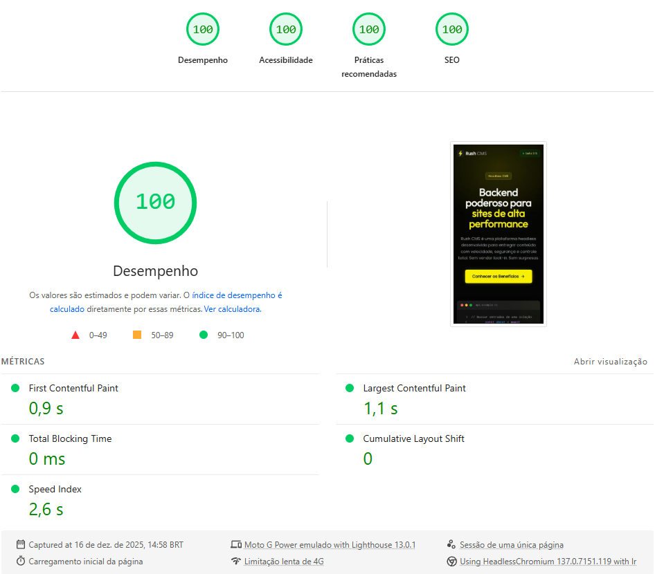

# Rush CMS Website

> High-performance Headless CMS. Fast, secure, no vendor lock-in.

---

## What the heck is Rush CMS?

Rush CMS is a headless content management platform built for websites that need to load fast. Built with Laravel 12, PostgreSQL, and Redis. Optimized for performance.

### Key Points

- **< 50ms API response** — Optimized queries, smart caching
- **No vendor lock-in** — Export your data anytime
- **Multi-tenant** — Complete data isolation per site
- **30+ field types** — Build any content structure

## Availability

**Rush CMS is a closed platform.**

~Currently~ Not sold separately. Available exclusively through [rafhael.com.br](https://rafhael.com.br) as part of high-performance website services.